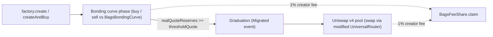

> ## Documentation Index
> Fetch the complete documentation index at: https://docs.bags.fm/llms.txt
> Use this file to discover all available pages before exploring further.

# Robinhood Chain Overview

> How the Bags protocol works on Robinhood Chain: token lifecycle, fees, chain facts, and the full contract address book for third-party integrators.

Bags is deployed on **Robinhood Chain** as a set of public, permissionless smart contracts. Unlike the Solana integration (which is driven by the Bags REST API and SDK), the Robinhood Chain integration is **fully on-chain**: you launch, trade, and claim fees by calling the contracts directly with a standard EVM library such as [viem](https://viem.sh) or [ethers](https://docs.ethers.org).

These guides show third-party developers how to integrate launching and trading against those contracts. No API key is required to interact with the chain.

<Note>
  "Robinhood" here means **Robinhood Chain**, an EVM Layer 2 (Arbitrum Orbit) with chain ID `4663` and ETH as the native gas token. It is a separate chain from Solana and from BNB Chain.
</Note>

## What you can do

* **Launch a token** through the `BagsFactory` (with an optional atomic initial buy). See [Launch a Token](/robinhood/launch-token).
* **Trade** a token against its bonding curve before graduation, and against a Uniswap v4 pool after graduation. See [Trade Tokens](/robinhood/trade-tokens).
* **Read state and discover tokens** through `BagsLens` and the factory registry. See [Read State & Discover Tokens](/robinhood/read-state).
* **Claim creator fees** from a token's `BagsFeeShare`. See [Claim Creator Fees](/robinhood/claim-fees).

Start with the [Environment Setup](/robinhood/setup) guide to configure your clients and ABIs.

## Token lifecycle

Every Bags token moves through two trading phases. It is created on a **bonding curve**; once enough ETH has been raised it **graduates** (migrates) into a Uniswap v4 pool with permanently locked liquidity.

1. **Creation** — `BagsFactory.create` (or `createAndBuy`) deploys a per-token `BagsToken`, `BagsBondingCurve`, and `BagsFeeShare`, mints the fixed supply to the curve, and registers the token.
2. **Bonding curve** — trades run against the token's `BagsBondingCurve` using a virtual `x * y = k` AMM. Buys send native ETH; sells return native ETH. 830M of the 1B supply is sold on the curve.
3. **Graduation** — when the curve's real ETH reserves reach `thresholdQuote`, the next buy triggers migration: the remaining 170M tokens plus the full raise are deposited into a Uniswap v4 pool (with the Bags hook) at the curve's final price, the LP is locked, and the curve is paused. The curve emits a `Migrated` event.
4. **Uniswap v4** — after graduation, trades route through the Robinhood-modified UniversalRouter against the token/WETH pool.

<Note>
  Determine the current phase by reading the token's `migrated` flag from `BagsLens.getTokenState`, and route trades accordingly. Never assume a phase.
</Note>

## Fee model

A flat **2% fee is charged on the ETH/WETH leg of every trade, in both phases**, split into two halves:

| Portion       | Rate                | Destination                                                                                       |
| ------------- | ------------------- | ------------------------------------------------------------------------------------------------- |
| Creator half  | 1% (50% of the fee) | The token's `BagsFeeShare` (accrues in WETH) — split among the fee claimers by their basis points |
| Protocol half | 1% (50% of the fee) | Split between the optional **partner** and `BagsVault`                                            |

* On **buys**, the fee is taken from the ETH input before it enters the curve/pool.
* On **sells**, the fee is taken from the ETH output.
* The **creator half** goes entirely to the token's fee claimers, pro-rata by the basis points set at launch. Claim it with [`BagsFeeShare.claim`](/robinhood/claim-fees).
* The **protocol half** is split: if the launch has a partner, the partner receives `protocolHalf x partnerFeeBps / 10000` (accrued in WETH in `BagsFeeShare`); the remainder goes to `BagsVault`. `partnerFeeBps` is a factory global (default `2500` = 0.25% of volume) snapshotted per launch.

There is also a one-time **launch fee** (`creationFee`, default 0.02 ETH) paid to the vault when a token is created.

<Warning>
  `factory.creationFee()`, `factory.graduationThreshold()`, and `factory.partnerFeeBps()` are owner-settable globals on the factory and can change; each launch snapshots them at `create()` time. Each curve exposes its own `thresholdQuote()` and `partnerFeeBps()` — the per-launch snapshots. Always read these live from the contracts before rendering or signing — never hardcode.
</Warning>

## Chain facts

| Fact                  | Value                                                                               |
| --------------------- | ----------------------------------------------------------------------------------- |
| Network               | Robinhood Chain (Arbitrum Orbit L2)                                                 |
| Chain ID              | `4663` (`0x1237`)                                                                   |
| Native currency       | ETH (18 decimals)                                                                   |
| RPC (public)          | `https://rpc.mainnet.chain.robinhood.com` (rate-limited)                            |
| Explorer              | [robinhoodchain.blockscout.com](https://robinhoodchain.blockscout.com) (Blockscout) |
| Block time            | \~100 ms, first-come-first-served sequencer                                         |
| Protocol deploy block | `7887312` (lower bound for any log scan)                                            |

<Warning>
  Because the sequencer is first-come-first-served and blocks are \~100 ms:

  * Use **timestamps**, not block numbers, for transaction deadlines.
  * The public RPC is rate-limited — batch reads with viem multicall (see [Setup](/robinhood/setup)).
  * Priority fees buy nothing; gas is negligible.
</Warning>

## Contract address book

These are the protocol singletons and shared infrastructure on Robinhood Chain mainnet.

| Contract        | Address                                      | Role                                                       |
| --------------- | -------------------------------------------- | ---------------------------------------------------------- |
| `BagsFactory`   | `0xe8Cc4431adF8b5A847C113EF0c6af9043219Cb37` | Launch entry point + on-chain registry                     |
| `BagsLens`      | `0xC82Db941dAf90B754aecb5F7D14c683dc608d595` | Batched read aggregator (state, claimable)                 |
| `BagsV4Hook`    | `0x2380aBf72C17aABAb76480244759AC7E2932EEcC` | Singleton Uniswap v4 hook; takes the 2% post-migration fee |
| `BagsVault`     | `0x4861446aa7fFd9e67a83cBbAcb1A4B70540B83Aa` | Platform treasury (native ETH)                             |
| UniversalRouter | `0x8876789976dEcBfCbBbe364623C63652db8C0904` | **Robinhood-modified fork** — post-migration swaps         |
| V4Quoter        | `0x8Dc178eFB8111BB0973Dd9d722ebeFF267c98F94` | Off-chain quotes for pool swaps                            |
| StateView       | `0xF3334192D15450CdD385c8B70e03f9A6bD9E673b` | Pool state reads (`getSlot0`, `getLiquidity`)              |
| PoolManager     | `0x8366a39CC670B4001A1121B8F6A443A643e40951` | Uniswap v4 singleton (`Swap` logs)                         |
| PositionManager | `0x58daec3116aae6D93017bAAea7749052E8a04fA7` | Uniswap v4 periphery (migration LP mint)                   |
| Permit2         | `0x000000000022D473030F116dDEE9F6B43aC78BA3` | Canonical Permit2 (router spending route)                  |
| WETH            | `0x0Bd7D308f8E1639FAb988df18A8011f41EAcAD73` | aeWETH proxy (WETH9-compatible interface)                  |
| Multicall3      | `0xcA11bde05977b3631167028862bE2a173976CA11` | Canonical multicall                                        |

`BagsFactory` and `BagsVault` are UUPS proxies — the addresses above are stable across upgrades, so always integrate against them (never against implementation addresses).

<Warning>
  The UniversalRouter above is a **modified fork**. Its v4 swap struct carries an extra `minHopPriceX36` field, so stock Uniswap SDK calldata will revert. Two other router look-alikes exist on this chain — only this address is correct. See [Trade Tokens](/robinhood/trade-tokens) for the exact encoding.
</Warning>

### Per-token contracts

`BagsBondingCurve` and `BagsFeeShare` are deployed **per launch** as beacon proxies, and `BagsToken` as an immutable [EIP-1167 minimal proxy clone](https://eips.ethereum.org/EIPS/eip-1167). Their addresses are **not predictable** before launch.

Always resolve them from:

* The `TokenCreated` event in the launch receipt (returns `token`, `curve`, `feeShare`, `partner`, `poolId`), or
* The factory registry: `factory.curveForToken(token)` and `factory.feeShareForToken(token)`, or
* `BagsLens.getTokenState(token)` (returns `curve`, `feeShare`, `poolId`, and more).

Never hardcode per-token addresses.

## Token supply

Every Bags token has a fixed supply of **1,000,000,000 (1e9) tokens**, each with 18 decimals (`1_000_000_000 * 1e18` base units). Fully diluted valuation (FDV) equals the spot price in ETH per token multiplied by `1e9`.

## Next steps

<CardGroup cols={2}>
  <Card title="Environment Setup" icon="wrench" href="/robinhood/setup">
    Configure your viem clients and ABIs for Robinhood Chain.
  </Card>

  <Card title="Launch a Token" icon="rocket" href="/robinhood/launch-token">
    Create a token through the BagsFactory.
  </Card>

  <Card title="Trade Tokens" icon="arrow-right-arrow-left" href="/robinhood/trade-tokens">
    Buy and sell across the bonding curve and Uniswap v4.
  </Card>

  <Card title="Contracts Reference" icon="file-contract" href="/robinhood/contracts">
    Functions, events, errors, and ABIs.
  </Card>
</CardGroup>
