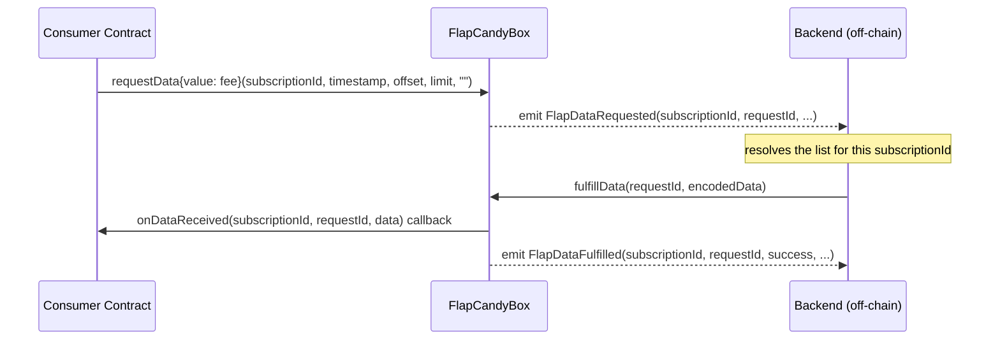

> For the complete documentation index, see [llms.txt](https://docs.flap.sh/flap/llms.txt). Markdown versions of documentation pages are available by appending `.md` to page URLs; this page is available as [Markdown](https://docs.flap.sh/flap/developers/preview/flap-candy-box.md).

# Flap Candy Box

## Overview

Flap Candy Box is an on-chain data oracle that delivers paginated, addressable lists to consumer contracts via a request-response callback pattern. It serves as an infrastructure layer for programmable, transparent, and automated reward distribution — vaults and other smart contracts can access dynamic CandyBox lists on-chain and act on them automatically, without maintaining the lists themselves.

Each subscription ID represents a list — it could be a static snapshot, a dynamically refreshed dataset, or any curated set of addresses. The first subscription is provided by Flap and refreshed every 24 hours, featuring the most active users from the previous day's trading activity on Flap. More subscriptions will be added over time.

> Want to build your own custom list? [Reach out to us](https://flap.sh) — we'd love to explore it with you.

**Deployed addresses:**

| Network     | Address                                      | Max Callback Gas |
| ----------- | -------------------------------------------- | ---------------- |
| BSC Mainnet | `0x6255fbd731272a517022e99f6CaCf6A5De9414Ee` | 2,000,000        |
| BSC Testnet | `0x8e6C16Bf07022a7Da9398B543f38846E9355Bd70` | 2,000,000        |

**Max Callback Gas:** The maximum gas limit supported for an `onDataReceived` callback.

### How it works



**Step by step:**

1. The consumer contract calls `requestData()`, paying the subscription fee and specifying the page (`offset`, `limit`) to fetch.
2. The oracle records the request and emits `FlapDataRequested`.
3. The backend queries the previous day's trade data and encodes it as a `ResponseData` struct.
4. The backend calls `fulfillData(requestId, encodedData)` on the oracle.
5. The oracle forwards the data to the consumer via `onDataReceived()` with a bounded gas limit.
6. The oracle emits `FlapDataFulfilled` with the callback outcome.

### Request status lifecycle

```
PENDING → FULFILLED   (callback succeeded)
        → FAILED      (callback reverted — eligible for retry by operator)
```

If the consumer's `onDataReceived()` reverts, the request status is set to `FAILED`. The oracle operator can retry delivery via `retryFulfillData()` once the consumer issue is resolved.

***

## Subscriptions

Each subscription defines a dataset, its pricing, and the maximum page size.

```solidity
IFlapCandyBox.Subscription[] memory subs = IFlapCandyBox(oracleAddress).getSubscriptions();
```

| Field            | Type      | Description                                           |
| ---------------- | --------- | ----------------------------------------------------- |
| `subscriptionId` | `bytes32` | Pass to `requestData()`                               |
| `description`    | `string`  | Human-readable rule                                   |
| `responseStruct` | `string`  | Struct name for decoding `data` in `onDataReceived()` |
| `fee`            | `uint256` | Required `msg.value` per request (wei)                |
| `maxLimit`       | `uint32`  | Maximum records per page                              |

> **Current limit cap:** `maxLimit` is **145** per request. This accounts for consumer contracts that store the returned records on-chain — larger payloads may exceed the callback gas budget. Use pagination for more records.

### Available subscriptions

| Constant             | `subscriptionId`                  | Description                                                                                                                           | `responseStruct` |
| -------------------- | --------------------------------- | ------------------------------------------------------------------------------------------------------------------------------------- | ---------------- |
| `FLAP_TRADE_BNB_24H` | `keccak256("FLAP_TRADE_BNB_24H")` | Addresses based on their trading activity in the previous 24 hours — across both Bonding Curve and DEX — on tokens launched from Flap | `ResponseData`   |

Fees may change. Always call `getFee(subscriptionId)` on-chain immediately before sending `requestData()`.

***

## How to integrate

### Step 1 — Query the fee

```solidity
uint256 fee = IFlapCandyBox(oracleAddress).getFee(subscriptionId);
```

### Step 2 — Call `requestData()`

```solidity
bytes32 requestId = IFlapCandyBox(oracleAddress).requestData{value: fee}(
    subscriptionId,
    uint64(block.timestamp), // backend derives previous day's window from this
    offset,                  // zero-based page offset
    limit,                   // records per page, must be <= maxLimit
    ""                       // extraParams: leave empty
);
```

> Pass `block.timestamp` directly — do not manually compute `startTime`/`endTime`. The backend derives the previous UTC day window from the request timestamp.

**Pagination example** — fetching 3000 addresses in pages of 145:

```solidity
// Page 0: offset=0,   limit=145
// Page 1: offset=145, limit=145
// Page 2: offset=290, limit=145
// ...
// Use ResponseData.totalSize from the first callback to calculate how many pages are needed.
```

### Step 3 — Implement the consumer

The recommended approach is to inherit `FlapCandyBoxConsumerBase`, which provides the `onlyFlapCandyBox` modifier and hardcoded address resolution automatically.

```solidity
// SPDX-License-Identifier: MIT
pragma solidity ^0.8.13;

import {IFlapCandyBox, FlapCandyBoxConsumerBase} from "src/interfaces/IFlapCandyBox.sol";

contract MyVault is FlapCandyBoxConsumerBase {

    bytes32 public constant SUBSCRIPTION_BNB = keccak256("FLAP_TRADE_BNB_24H");

    mapping(bytes32 => bool) private _fulfilled;

    function requestStats(uint32 offset, uint32 limit) external payable returns (bytes32 requestId) {
        IFlapCandyBox oracle = IFlapCandyBox(_getFlapCandyBox());
        uint256 fee = oracle.getFee(SUBSCRIPTION_BNB);
        requestId = oracle.requestData{value: fee}(
            SUBSCRIPTION_BNB,
            uint64(block.timestamp),
            offset,
            limit,
            ""
        );
    }

    // Called by FlapCandyBox — protected by onlyFlapCandyBox modifier from base contract
    function _onDataReceived(
        bytes32 subscriptionId,
        bytes32 requestId,
        bytes calldata data
    ) internal override {
        require(!_fulfilled[requestId], "already fulfilled");
        _fulfilled[requestId] = true; // mark before any external calls

        if (subscriptionId == SUBSCRIPTION_BNB) {
            IFlapCandyBox.ResponseData memory resp = abi.decode(data, (IFlapCandyBox.ResponseData));
            // resp.totalSize   — total qualifying addresses across all pages
            // resp.totalAmount — sum of tradeAmount across ALL matching records (not just this page)
            // resp.records     — address-level records for this page
            // resp.startTime / resp.endTime — actual data window
            _handleDistribution(resp);
        }
    }

    function _handleDistribution(IFlapCandyBox.ResponseData memory resp) internal {
        for (uint256 i = 0; i < resp.records.length; i++) {
            // distribute proportionally using resp.records[i].wallet and resp.records[i].tradeAmount
        }
    }
}
```

Alternatively, implement `IFlapCandyBoxConsumer` directly and validate `msg.sender` yourself:

```solidity
function onDataReceived(bytes32 subscriptionId, bytes32 requestId, bytes calldata data) external override {
    require(msg.sender == address(oracle), "Only FlapCandyBox");
    // ...
}
```

***

## ResponseData struct

The `data` payload in `onDataReceived()` is ABI-encoded as `ResponseData`. Use `getSubscription(subscriptionId).responseStruct` to confirm the struct name for each subscription.

```solidity
struct AddressRecord {
    address wallet;
    uint256 tradeAmount; // 1e18-scaled; BNB subscription → wei, USD subscription → 1e18-scaled USD
}

struct ResponseData {
    uint256 totalSize;     // total records matching the query across all pages
    uint256 offset;        // zero-based index of the first record in this page
    uint256 returnedCount; // actual number of records in this page (may be < limit on last page)
    bool isDesc;           // true — records are sorted by tradeAmount descending
    uint64 startTime;      // query window start (Unix timestamp, UTC 00:00:00)
    uint64 endTime;        // query window end   (Unix timestamp, UTC 23:59:59)
    uint256 totalAmount;   // sum of tradeAmount across ALL matching records (not just this page)
    AddressRecord[] records;
}
```

> Use `totalSize` (not `returnedCount`) for proportional distribution calculations across pages.

***

## Security checklist

| Item                  | Detail                                                                                        |
| --------------------- | --------------------------------------------------------------------------------------------- |
| Validate `msg.sender` | Use `FlapCandyBoxConsumerBase` (recommended) or `require(msg.sender == address(oracle))`      |
| Guard double-delivery | Track a `fulfilled` flag per `requestId` and revert on repeat                                 |
| Reentrancy            | Mark fulfilled **before** any external calls or token transfers                               |
| Callback gas          | Keep `onDataReceived()` within `getMaxCallbackGas()`; check with `oracle.getMaxCallbackGas()` |
| Fee freshness         | Call `getFee()` immediately before sending `requestData()` — fees may change                  |
| Page size             | Use `getMaxLimit(subscriptionId)` to check the current cap before submitting                  |

***

## Reference

### Full interface

```solidity
// SPDX-License-Identifier: MIT
pragma solidity ^0.8.13;

interface IFlapCandyBox {

    // ── Enums ────────────────────────────────────────────────────────────────

    enum RequestStatus {
        PENDING,   // 0 — created, waiting for fulfiller
        FULFILLED, // 1 — data delivered and consumer callback succeeded
        FAILED     // 2 — data delivered but consumer callback reverted; eligible for retry
    }

    // ── Structs ──────────────────────────────────────────────────────────────

    struct Subscription {
        bytes32 subscriptionId;
        string description;
        string responseStruct; // name of the ResponseData struct, e.g. "ResponseData"
        uint256 fee;           // required msg.value per requestData() call (wei)
        uint32 maxLimit;       // maximum allowed limit per request
        bool active;
    }

    struct OracleRequest {
        address consumer;
        bytes32 subscriptionId;
        uint64 timestamp;  // caller's block.timestamp; backend derives previous day's window
        uint32 offset;
        uint32 limit;
        bytes extraParams;
        uint128 feePaid;
        RequestStatus status;
    }

    struct AddressRecord {
        address wallet;
        uint256 tradeAmount;
    }

    struct ResponseData {
        uint256 totalSize;     // total records matching the query across all pages
        uint256 offset;        // zero-based index of the first record in this page
        uint256 returnedCount; // actual records in this page
        bool isDesc;           // true if sorted by tradeAmount descending
        uint64 startTime;      // query window start (Unix timestamp)
        uint64 endTime;        // query window end   (Unix timestamp)
        uint256 totalAmount;   // sum of tradeAmount across ALL matching records (not just this page)
        AddressRecord[] records;
    }

    // ── Events ───────────────────────────────────────────────────────────────

    event FlapSubscriptionRegistered(bytes32 indexed subscriptionId, string description, uint256 fee);
    event FlapSubscriptionFeeUpdated(bytes32 indexed subscriptionId, uint256 oldFee, uint256 newFee);
    event FlapSubscriptionLimitUpdated(bytes32 indexed subscriptionId, uint32 oldLimit, uint32 newLimit);
    event FlapDataRequested(
        bytes32 indexed subscriptionId,
        bytes32 indexed requestId,
        address indexed consumer,
        uint64 timestamp,
        uint32 offset,
        uint32 limit,
        uint256 feePaid,
        bytes extraParams
    );
    event FlapDataFulfilled(bytes32 indexed subscriptionId, bytes32 indexed requestId, bool success, bytes returnData);
    event FlapFulfillerUpdated(address indexed fulfiller, bool authorized);

    // ── Errors ───────────────────────────────────────────────────────────────

    error InvalidSubscription(bytes32 subscriptionId);
    error SubscriptionAlreadyExists(bytes32 subscriptionId);
    error InsufficientFee(uint256 required, uint256 provided);
    error LimitExceeded(uint32 requested, uint32 max);
    error AlreadyFulfilled(bytes32 requestId);
    error InvalidRequestId(bytes32 requestId);
    error OnlyFulfiller();
    error RequestNotFailed(bytes32 requestId, RequestStatus status);
    error RetryFailed(bytes32 requestId, bytes returnData);

    // ── Write ────────────────────────────────────────────────────────────────

    /// @notice Submit a data request. Emits FlapDataRequested for the backend to pick up.
    /// @param subscriptionId  Identifies which dataset and pricing rule to query.
    /// @param timestamp       Pass block.timestamp. Backend derives previous day's window from this.
    /// @param offset          Zero-based page offset (first page = 0).
    /// @param limit           Records per page. Must be <= getMaxLimit(subscriptionId).
    /// @param extraParams     Reserved. Pass "".
    /// @return requestId      Store this to correlate the callback.
    function requestData(
        bytes32 subscriptionId,
        uint64 timestamp,
        uint32 offset,
        uint32 limit,
        bytes calldata extraParams
    ) external payable returns (bytes32 requestId);

    // ── View ─────────────────────────────────────────────────────────────────

    function getSubscription(bytes32 subscriptionId) external view returns (Subscription memory);
    function getSubscriptions() external view returns (Subscription[] memory);
    function getFee(bytes32 subscriptionId) external view returns (uint256);
    function getMaxLimit(bytes32 subscriptionId) external view returns (uint32);
    function getRequest(bytes32 requestId) external view returns (OracleRequest memory);
    function getMaxCallbackGas() external view returns (uint256);
}

/// @notice Base contract for FlapCandyBox consumers.
/// @dev Inherit this to get address resolution and the onlyFlapCandyBox modifier for free.
abstract contract FlapCandyBoxConsumerBase {
    error FlapCandyBoxConsumerOnlyBox();
    error FlapCandyBoxConsumerUnsupportedChain(uint256 chainId);

    modifier onlyFlapCandyBox() {
        if (msg.sender != _getFlapCandyBox()) revert FlapCandyBoxConsumerOnlyBox();
        _;
    }

    /// @notice Returns the FlapCandyBox proxy address for the current chain.
    function _getFlapCandyBox() internal view virtual returns (address) {
        uint256 id = block.chainid;
        if (id == 56)  return 0x6255fbd731272a517022e99f6CaCf6A5De9414Ee; // BSC Mainnet
        if (id == 97)  return 0x8e6C16Bf07022a7Da9398B543f38846E9355Bd70; // BSC Testnet
        revert FlapCandyBoxConsumerUnsupportedChain(id);
    }

    function onDataReceived(bytes32 subscriptionId, bytes32 requestId, bytes calldata data)
        external virtual onlyFlapCandyBox
    {
        _onDataReceived(subscriptionId, requestId, data);
    }

    function _onDataReceived(bytes32 subscriptionId, bytes32 requestId, bytes calldata data) internal virtual;
}

/// @notice Minimal interface for consumers that prefer not to use the base contract.
interface IFlapCandyBoxConsumer {
    function onDataReceived(bytes32 subscriptionId, bytes32 requestId, bytes calldata data) external;
}
```
