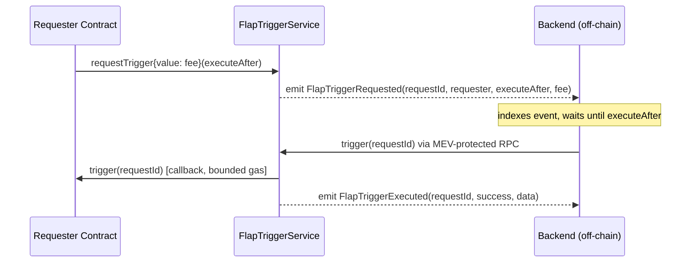

> For the complete documentation index, see [llms.txt](https://docs.flap.sh/flap/llms.txt). Markdown versions of documentation pages are available by appending `.md` to page URLs; this page is available as [Markdown](https://docs.flap.sh/flap/developers/preview/flap-trigger-service.md).

# Flap Trigger Service

## Overview

FlapTriggerService is a decentralized on-chain scheduler that allows smart contracts to request delayed or immediate function callbacks executed by a trusted backend. It bridges on-chain logic with off-chain coordination, enabling complex time-sensitive operations without requiring the caller to manage execution timing directly.

**Deployed addresses:**

| Network                 | Address                                      | Max Gas Limit |
| ----------------------- | -------------------------------------------- | ------------- |
| BNB Chain Mainnet       | `0xcf4EE25035CF883895110f367F5BA8172416a7F9` | 2,000,000     |
| BNB Chain Testnet       | `0x560E9830926C9e0EB98a59c6b9902383Fc0D9Eb2` | 2,000,000     |
| Robinhood Chain Mainnet | `0xD3421B1b616a72bB88993A0cf75709BB8D532cc1` | 2,000,000     |
| Robinhood Chain Testnet | `0x34e7624e2c8F944Db1adD9a604fdB7C439CaEa1c` | 2,000,000     |

**Max Gas Limit:** The maximum gas limit supported for a `trigger` callback.

**Primary use cases:**

* Time-delayed operations (vesting unlocks, periodic distributions, deferred settlements)
* Backend-coordinated operations requiring MEV protection
* Operations that need external computation before on-chain execution

### How it works



**Step by step:**

1. The requester contract calls `requestTrigger()`, paying the required gas fee and specifying an `executeAfter` timestamp (or `0` for immediate execution).
2. The service records the request and emits a `FlapTriggerRequested` event.
3. The off-chain backend monitors for these events and indexes all pending requests.
4. When the scheduled time arrives, the backend submits a `trigger(requestId)` transaction via an MEV-protected RPC (e.g., Flashbots, BloXroute).
5. FlapTriggerService calls back `requester.trigger(requestId)` with a bounded gas limit.
6. The requester's callback uses the `requestId` to identify and execute the intended operation.

### Timing guarantees


`executeAfter` is a lower bound, not a hard deadline. The service only guarantees that execution happens **after** `executeAfter`.


Integrators **must** assume there can be an unpredictable delay due to:

* Network congestion
* Backend processing latency
* Block inclusion delays
* MEV protection overhead

Requester contracts **must** be designed to handle late execution gracefully and **must not** rely on execution at a precise time.

***

## Trigger pricing

A fixed native-currency fee is charged per trigger request, set independently per network:

| Network                 | Current Fee |
| ----------------------- | ----------- |
| BNB Chain Mainnet       | 0.0002 BNB  |
| BNB Chain Testnet       | 0.0002 BNB  |
| Robinhood Chain Mainnet | 0.0004 ETH  |
| Robinhood Chain Testnet | 0.0004 ETH  |

This fee covers:

* Gas costs for the backend's `trigger()` transaction
* Gas costs for the callback to the requester contract
* A small service fee


**Robinhood Chain fee is temporarily elevated.** Due to gas-price fluctuation on Robinhood Chain, the current fee is set higher than strictly necessary while we evaluate a more precise pricing approach. This fee is expected to change.

**Always call `getFee()` at call time — never hardcode the fee value.** This applies to every network, including BNB Chain. BNB Chain's fee is fixed today, but Robinhood Chain's fee is expected to become **dynamic** in the future: when Ethereum L1 (which Robinhood Chain settles to) is congested and gas is expensive, the fee may be increased; when the network is quiet, it may be decreased. A contract that hardcodes the fee instead of calling `getFee()` on every `requestTrigger()` call will eventually either underpay (causing `InsufficientGasFee` reverts) or overpay unnecessarily once dynamic pricing is in effect.


**Getting the current fee:**

```solidity
uint256 fee = IFlapTriggerService(triggerService).getFee();
```

The fee is paid upfront when calling `requestTrigger()` as `msg.value`. Excess payment above the required fee is accumulated as protocol fees — there is no refund for overpayment.

**Callback gas limit:**

Each trigger callback is forwarded at most `getMaxCallbackGas()` gas. Requester contracts must ensure their `trigger()` callback completes within this limit. Exceeding the limit will cause the callback to fail (status becomes `FAILED`).

```solidity
uint256 maxGas = IFlapTriggerService(triggerService).getMaxCallbackGas();
```

**Failed callbacks and retry:**

If a callback fails (e.g., out of gas or revert), the request status is set to `FAILED`. Anyone can retry a failed request by calling `retryTrigger(requestId)` — this forwards all available gas to the callback, allowing the caller to supply sufficient gas. The fee stored in the request is transferred to the fee receiver on successful retry.

***

## How to integrate

### Step 1 — Import the interfaces

```solidity
import { IFlapTriggerService } from "src/misc/IFlapTriggerService.sol";
import { ITriggerReceiver } from "src/misc/IFlapTriggerService.sol";
```

### Step 2 — Implement `ITriggerReceiver`

Your contract must implement the `trigger(uint256 requestId)` callback. This function is called by FlapTriggerService when the scheduled time has passed.

**Security requirements for the callback:**

* **Must** validate `msg.sender == address(triggerService)`
* **Should** implement a reentrancy guard if performing external calls or state changes
* **Must** complete within `getMaxCallbackGas()` gas
* **Must not** assume execution happens exactly at `executeAfter` — always assume potential delay

### Step 3 — Schedule a trigger

Call `requestTrigger()` with the desired `executeAfter` timestamp. Store the returned `requestId` to map it back to the intended operation in your callback.

### Pseudo-code example

```solidity
// SPDX-License-Identifier: MIT
pragma solidity ^0.8.13;

import { IFlapTriggerService, ITriggerReceiver } from "src/misc/IFlapTriggerService.sol";
import { ReentrancyGuard } from "@openzeppelin/utils/ReentrancyGuard.sol";

contract MyScheduledVault is ITriggerReceiver, ReentrancyGuard {

    IFlapTriggerService public immutable triggerService;

    struct PendingAction {
        address recipient;
        uint256 amount;
    }

    mapping(uint256 => PendingAction) private pendingActions;

    constructor(address _triggerService) {
        triggerService = IFlapTriggerService(_triggerService);
    }

    /// @notice Schedule a delayed distribution 1 day from now.
    function scheduleDistribution(address recipient, uint256 amount) external payable {
        // 1. Get the required fee
        uint256 fee = triggerService.getFee();

        // 2. Request the trigger (executeAfter = 1 day from now)
        uint256 requestId = triggerService.requestTrigger{value: fee}(
            uint64(block.timestamp + 1 days)
        );

        // 3. Store the action data keyed by requestId
        pendingActions[requestId] = PendingAction({
            recipient: recipient,
            amount: amount
        });
    }

    /// @notice Called back by FlapTriggerService after executeAfter has passed.
    function trigger(uint256 requestId) external nonReentrant override {
        // SECURITY: only the trigger service can call this
        require(msg.sender == address(triggerService), "Only trigger service");

        PendingAction memory action = pendingActions[requestId];
        require(action.recipient != address(0), "Unknown requestId");

        // Clean up before external call (checks-effects-interactions)
        delete pendingActions[requestId];

        // Execute the intended operation
        // NOTE: Execution may happen well after the scheduled time — design accordingly
        _distribute(action.recipient, action.amount);
    }

    function _distribute(address recipient, uint256 amount) internal {
        // ... distribution logic ...
    }
}
```

### Scheduling for immediate execution

Pass `0` as `executeAfter` to request execution as soon as the backend processes the event:

```solidity
uint256 requestId = triggerService.requestTrigger{value: fee}(0);
```

### Querying request status

```solidity
// Get details about a specific request
IFlapTriggerService.TriggerRequest memory req = triggerService.getRequest(requestId);
// req.status: PENDING (0), EXECUTED (1), FAILED (2)
// req.executeAfter: scheduled time
// req.feePaid: fee paid (wei)

// Check if a request is ready to execute right now
bool ready = triggerService.isRequestReady(requestId);

// Get all requests by your contract (paginated, newest first)
(IFlapTriggerService.TriggerRequest[] memory page, uint256 total) =
    triggerService.getRequestsByRequesterPaginated(address(this), 0, 20);
```

### Retrying a failed trigger

If a callback fails (e.g., the callback used more gas than the limit), anyone can retry:

```solidity
triggerService.retryTrigger(requestId);
```

***

## Reference

### Full interface

```solidity
// SPDX-License-Identifier: MIT
pragma solidity ^0.8.13;

interface IFlapTriggerService {

    // ── Enums ────────────────────────────────────────────────────────────────

    enum TriggerStatus {
        PENDING,   // 0 — Request created, waiting to be executed
        EXECUTED,  // 1 — Successfully executed by the backend
        FAILED     // 2 — Execution attempted but the callback reverted
    }

    // ── Structs ──────────────────────────────────────────────────────────────

    /// @notice Packed into two 32-byte storage slots.
    /// Slot 0: status (8 bits) | executeAfter (64 bits) | requester (160 bits) | 24 bits reserved
    /// Slot 1: feePaid (128 bits)
    struct TriggerRequest {
        address requester;    // 160 bits — address that requested the trigger
        uint64 executeAfter;  // 64 bits  — Unix timestamp lower bound for execution
        TriggerStatus status; // 8 bits   — current lifecycle status
        uint128 feePaid;      // 128 bits — native fee paid in wei (slot 1)
    }

    // ── Events ───────────────────────────────────────────────────────────────

    /// @notice Emitted when a new trigger request is created.
    event FlapTriggerRequested(
        uint256 requestId,
        address indexed requester,
        uint64 executeAfter,
        uint256 gasFeesPaid
    );

    /// @notice Emitted when a trigger execution is attempted (success or failure).
    event FlapTriggerExecuted(uint256 requestId, bool success, bytes data);

    /// @notice Emitted when a trigger is skipped (invalid ID, wrong status, or not yet due).
    event FlapTriggerSkipped(uint256 requestId, string reason);

    /// @notice Emitted when the required gas fee is updated by admin.
    event FlapTriggerGasFeeUpdated(uint256 oldFee, uint256 newFee);

    /// @notice Emitted when the maximum callback gas limit is updated by admin.
    event FlapTriggerMaxCallbackGasUpdated(uint256 oldLimit, uint256 newLimit);

    // ── Errors ───────────────────────────────────────────────────────────────

    /// @notice msg.value is below the required fee.
    error InsufficientGasFee(uint256 required, uint256 provided);

    /// @notice Request is not in PENDING status.
    error InvalidRequestStatus(uint256 requestId, TriggerStatus currentStatus);

    /// @notice block.timestamp is before executeAfter.
    error TooEarly(uint256 requestId, uint64 executeAfter, uint256 currentTime);

    /// @notice The provided requestId does not exist.
    error InvalidRequestId(uint256 requestId);

    /// @notice Caller does not have TRIGGER_ROLE.
    error OnlyTriggerRole();

    /// @notice Admin tried to set an invalid gas fee (e.g., zero).
    error InvalidGasFee();

    /// @notice Admin tried to set an invalid gas limit (e.g., zero or too high).
    error InvalidGasLimit();

    /// @notice Fee receiver address is invalid (e.g., zero address).
    error InvalidFeeReceiver();

    /// @notice A retried trigger callback reverted.
    error RetryFailed(uint256 requestId, bytes data);

    /// @notice msg.value overflows uint128 and cannot be stored as feePaid.
    error FeePaidOverflow(uint256 provided);

    // ── Write methods ────────────────────────────────────────────────────────

    /// @notice Request a trigger callback at or after a specified time.
    /// @param executeAfter Unix timestamp after which execution may happen. Pass 0 for immediate.
    /// @return requestId   Unique ID for this trigger request.
    /// Requirements: msg.value >= getFee(); if executeAfter > 0, must be >= block.timestamp.
    function requestTrigger(uint64 executeAfter) external payable returns (uint256 requestId);

    /// @notice Execute a single pending trigger (backend only, requires TRIGGER_ROLE).
    /// @param requestId  The ID of the request to execute.
    function trigger(uint256 requestId) external;

    /// @notice Execute multiple pending triggers in one transaction (backend only, requires TRIGGER_ROLE).
    /// @param requestIds  Array of request IDs to execute. Invalid or already-done IDs are skipped.
    function triggerMultiple(uint256[] calldata requestIds) external;

    /// @notice Retry a previously failed trigger request. Callable by anyone.
    ///         Forwards all available gas; reverts with RetryFailed on failure.
    /// @param requestId  The ID of the FAILED request to retry.
    function retryTrigger(uint256 requestId) external;

    // ── View methods ─────────────────────────────────────────────────────────

    /// @notice The native-currency fee (wei) required as msg.value for requestTrigger().
    function getFee() external view returns (uint256 gasFee);

    /// @notice Maximum gas forwarded to a requester's callback. Callbacks must fit within this.
    function getMaxCallbackGas() external view returns (uint256 maxGas);

    /// @notice Get details about a single trigger request. Reverts for unknown IDs.
    function getRequest(uint256 requestId) external view returns (TriggerRequest memory request);

    /// @notice Total number of trigger requests ever created (= next request ID).
    function getRequestCount() external view returns (uint256 count);

    /// @notice True if the request exists, is PENDING, and block.timestamp >= executeAfter.
    function isRequestReady(uint256 requestId) external view returns (bool ready);

    /// @notice Fetch multiple requests by ID in one call. Unknown IDs return zero-initialised structs.
    function getRequests(uint256[] calldata requestIds) external view returns (TriggerRequest[] memory requests);

    /// @notice Paginated list of all requests, newest first (descending by ID).
    /// @param offset  Requests to skip from the newest.
    /// @param limit   Maximum number to return.
    function getRequestsPaginated(uint256 offset, uint256 limit)
        external
        view
        returns (TriggerRequest[] memory requests, uint256 total);

    /// @notice Paginated list of requests for a specific requester address, newest first.
    /// @param requester  Address whose requests to query.
    /// @param offset     Requests to skip from the newest.
    /// @param limit      Maximum number to return.
    function getRequestsByRequesterPaginated(address requester, uint256 offset, uint256 limit)
        external
        view
        returns (TriggerRequest[] memory requests, uint256 total);
}

/// @notice Interface that requester contracts must implement to receive trigger callbacks.
interface ITriggerReceiver {
    /// @notice Called by FlapTriggerService when a scheduled trigger executes.
    /// @dev MUST validate msg.sender == triggerService address.
    ///      SHOULD implement reentrancy guard.
    ///      MUST complete within getMaxCallbackGas().
    ///      MUST NOT assume execution at exactly executeAfter — delays are possible.
    /// @param requestId  ID of the trigger request being executed.
    function trigger(uint256 requestId) external;
}
```
