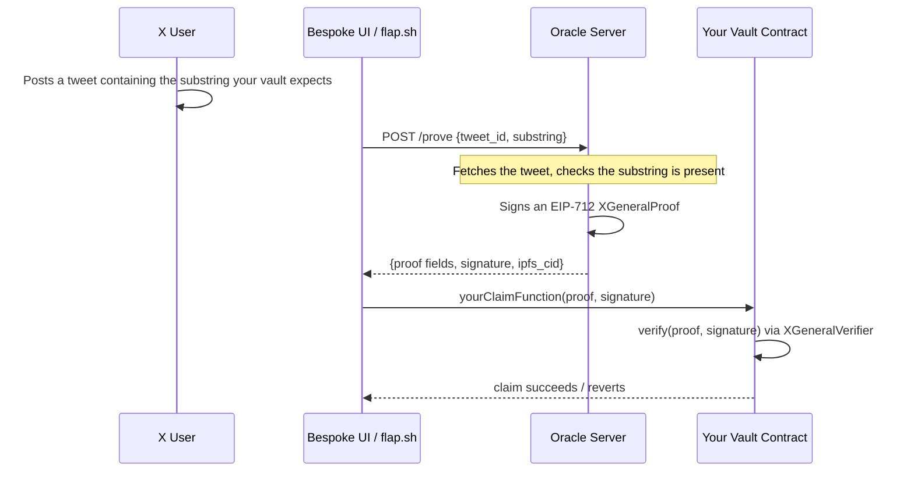

> For the complete documentation index, see [llms.txt](https://docs.flap.sh/flap/llms.txt). Markdown versions of documentation pages are available by appending `.md` to page URLs; this page is available as [Markdown](https://docs.flap.sh/flap/developers/preview/x-general-verifier.md).

# X General Verifier


**Preview.** This document has not been reviewed yet. Content may be incomplete or inaccurate. We are not exposing the oracle server's backend endpoint URL at this time. If you'd like to know the address or join a test, please [reach out to us](https://flap.sh).



**This page is for vault developers.** If you haven't yet, read [Vault & VaultFactory Specification](/flap/developers/vault-developers/vault-and-vaultfactory-specification.md) first to understand what a vault is and how it receives tax revenue. X General Verifier is infrastructure you plug **into** a vault's control logic — it is not a standalone product on its own.


## Why vault developers should care

A vault is the smart contract that receives a token's tax/fee revenue on Flap. What a vault *does* with that revenue — who can claim it, when, and under what condition — is entirely up to you, the vault developer. [Gift Vault](/flap/developers/vault-developers/gift-vault.md) is one existing example: it lets an X account prove ownership of a fixed "gift the fee from X to Y" tweet format and redirect the vault's fee flow.

X General Verifier generalizes that same idea into reusable infrastructure any vault can call into:

* The **substring** your vault checks for is entirely up to you — it isn't locked to a fixed sentence format like Gift Vault V2. Your vault can construct any expected tweet content it wants, at launch time or dynamically.
* The **on-chain verifier** and **off-chain oracle** are shared, audited infrastructure. You don't need to build or run your own signing service — just call `verify()` from your vault.
* It's **multi-chain** — the same oracle signer works across every deployment, so a vault design ported to a new chain doesn't need new backend integration.

In short: whenever your vault design needs to answer *"has account @X actually said Y?"* on-chain, this is the infrastructure to reach for instead of building your own oracle from scratch.

**Deployed addresses:**

| Network                 | XGeneralVerifier                             |
| ----------------------- | -------------------------------------------- |
| BSC Mainnet             | `0xcA8DBE6CAC4BFDc41226b0BaF2359fd99989b3E4` |
| BSC Testnet             | `0x236C4AF8e0674fB22a139DDE4C2A518CBA819932` |
| Robinhood Chain Mainnet | `0xccDaB0d5Bc6E0aCb8B157cffFA062688Aa849c17` |

The same oracle signing key is used across every chain — only the verifying contract address (and therefore the EIP-712 domain) differs per chain.


Want to build on this infrastructure for a new use case? [Reach out to us](https://flap.sh) — we're happy to help you integrate.


***

## The two parts

* **A stateless on-chain verifier** (`XGeneralVerifier`) — a pure EIP-712 signature verification contract. It holds no state beyond the oracle's signing key and does not track proof usage.
* **An off-chain oracle server** — fetches a tweet, checks that it contains the substring your vault expects, and signs an EIP-712 attestation over the result.

***

## How it works, end to end

A typical flow looks like this:

1. Your vault deploys with (or later computes) an **expected substring** — some exact text tied to the claim it's gating. This might embed a beneficiary address, a vault-specific nonce, a role name, anything your logic needs.
2. A user, or the specific X account your vault expects, posts a tweet containing that exact substring.
3. A **bespoke UI you build** — or Flap's own website, if your vault is registered there — asks the oracle server to prove the tweet exists and matches. This is a normal off-chain HTTP call, not a transaction.
4. Your UI receives back a signed `XGeneralProof` and forwards it, along with the signature, into a transaction calling your vault contract.
5. Your vault calls `XGeneralVerifier.verify(proof, signature)` on-chain. If it returns `true`, your vault executes whatever logic you've written — release funds, hand over control, unlock a new state, etc.



Nothing about steps 3–5 requires Flap's website. You are free to build a completely custom frontend that talks to the oracle and your vault directly — Flap's site is just one possible entry point into vaults that choose to register there.

***

## The `XGeneralProof` struct

```solidity
struct XGeneralProof {
    uint128 tweetId;    // The tweet's unique Snowflake ID
    string  xHandle;    // The X account's handle — always lowercase
    uint128 xId;        // The X account's numeric user ID
    string  substring;  // The substring matched inside the tweet text
}
```


`xHandle` is **always lowercase**. The oracle normalizes it before signing, and `XGeneralVerifier.verify()` rejects any proof containing an uppercase character in `xHandle` — it returns `false` rather than reverting. Always store expected handles in lowercase in your vault contract to avoid mismatches.


The `substring` match performed by the oracle is **case-sensitive**. Design your vault's expected substring deterministically (for example, embedding a lowercase hex address) so that off-chain callers and your on-chain check always agree exactly.

***

## `XGeneralVerifier` contract interface

```solidity
interface IXGeneralVerifier {
    /// @notice Verifies an oracle-signed XGeneralProof.
    /// @dev Stateless — does not track or prevent proof replay.
    function verify(
        XGeneralProof calldata proof,
        bytes calldata signature
    ) external view returns (bool);

    /// @notice The oracle signing address this verifier trusts.
    function oracleKey() external view returns (address);
}
```

`XGeneralVerifier` is intentionally minimal:

* **Pure verification only.** It checks the EIP-712 signature against the immutable `oracleKey` set at deployment. No storage is mutated after initialization.
* **No replay protection.** The contract itself does not remember which proofs have already been used. Your vault is responsible for its own replay guard.


**Recommended replay pattern:** track the last-used `tweetId` per beneficiary/context in your vault, and require `proof.tweetId > lastTweetId`. X assigns Snowflake IDs that are strictly increasing over time, so this is sufficient to prevent replay without any additional nonce infrastructure.


***

## Oracle server API

### `POST /prove`

```
POST /prove?chain_id=<optional>
```

**Request body:**

```json
{
  "tweet_id": "1234567890123456789",
  "substring": "the exact text that must appear in the tweet"
}
```

| Field       | Type             | Notes                                                                                       |
| ----------- | ---------------- | ------------------------------------------------------------------------------------------- |
| `tweet_id`  | string (numeric) | The tweet's Snowflake ID                                                                    |
| `substring` | string           | Must be non-empty and at most 200 bytes. Case-sensitive exact match against the tweet text. |

**Optional query parameter:**

| Parameter  | Behavior                                                                                                                                                                                         |
| ---------- | ------------------------------------------------------------------------------------------------------------------------------------------------------------------------------------------------ |
| `chain_id` | Selects which chain's `XGeneralVerifier` domain to sign for. If provided but not a supported chain, the request is rejected. If omitted, defaults to **BSC mainnet** for backward compatibility. |

**Response — 200 OK:**

```json
{
  "tweet_id": "1234567890123456789",
  "x_handle": "example",
  "x_id": "987654321",
  "substring": "the exact text that must appear in the tweet",
  "signature": "0x...",
  "ipfs_cid": "Qm...",
  "chain_id": 56,
  "verifier_address": "0xca8dbe6cac4bfdc41226b0baf2359fd99989b3e4"
}
```

`chain_id` and `verifier_address` in the response confirm which deployment the signature was produced for — check these match what your vault expects before submitting the proof on-chain.

**Error responses** return `400` for validation failures (empty/oversized substring, substring not found in the tweet, invalid or deleted tweet, unsupported `chain_id`) and `500` for unexpected internal errors.

***

## Supported chains

| Chain                   | `chain_id` |
| ----------------------- | ---------- |
| BSC Mainnet             | `56`       |
| BSC Testnet             | `97`       |
| Robinhood Chain Mainnet | `4663`     |

More chains are added over time as new `XGeneralVerifier` deployments go live.

***

## Vault design patterns you can build with this

X General Verifier only answers one question — *did this X account post this exact text?* — but that primitive composes into a surprising range of vault behaviors. A few starting points:

### 1. Ownership handoff (generalized Gift Vault)

The simplest pattern, and the one [Gift Vault](/flap/developers/vault-developers/gift-vault.md) already implements with a fixed sentence. With X General Verifier you control the substring yourself, so you can:

* Assign an X account as the sole controller of the vault at launch.
* Let that account prove control at any time by posting your vault's expected substring (e.g. `"<handle> controls the vault for <token>"`).
* Once proven, hand the account full authority over the vault — redirect fees, trigger a buyback, or unlock any other admin function you've written.

### 2. Tweet-gated claims / airdrops

Instead of (or in addition to) a merkle-drop, gate a claim behind a tweet:

* Your vault computes a per-claimant expected substring, e.g. `"<address> is claiming from <token>"`.
* Anyone can post that tweet from any account, fetch a proof, and call `claim()`.
* Combine this with a per-account allowlist, a time window, or a maximum-claims-per-day cap for extra control.

### 3. Recurring / scheduled unlocks

Because `tweetId` is a monotonically increasing Snowflake ID, your vault can enforce ordering over time without needing an off-chain scheduler:

* Require the *newest* qualifying tweet since the last claim — e.g. "the vault distributes to whichever address the owner's tweet points to today", refreshed once every 24 hours by requiring `block.timestamp - lastClaimTime >= 1 days` alongside the proof.
* Build a "daily invite" mechanic: each day, the vault owner tweets who to invite/unlock next; the invited address submits the proof to claim a time-boxed reward slot.

### 4. Social consensus / voting proxies

Use tweets as a lightweight signaling channel for on-chain actions:

* A DAO-style vault where the "vote" is a tweet containing a specific option string; the vault tallies claims/actions per option and the majority substring (by claim count within a window) triggers the payout path.
* Gate an emergency pause/resume function behind a specific X account posting a specific phrase, without needing a multisig UI.

### 5. Streak / engagement rewards

Combine multiple proofs over time:

* Require N distinct valid proofs (distinct `tweetId`s) from the same `xId` within a rolling window before a bonus payout unlocks — a simple on-chain "engagement streak."
* Reward the *first* account to post a given day's substring, using `tweetId` ordering to determine who was first.

None of these require touching the oracle or verifier contract — they're all vault-side logic built on top of one primitive: `XGeneralVerifier.verify()` returning `true`. If you have a design that doesn't fit the patterns above, [reach out to us](https://flap.sh) — we're always interested in what vault developers are building.

***

## Building a custom vault integration

A typical pattern for a vault contract:

```solidity
function claimByProof(
    IXGeneralVerifier.XGeneralProof calldata proof,
    bytes calldata signature
) external {
    // 1. Confirm the substring matches what this vault expects.
    require(
        keccak256(bytes(proof.substring)) == keccak256(bytes(expectedSubstring(msg.sender))),
        "substring mismatch"
    );

    // 2. Verify the oracle's signature.
    require(verifier.verify(proof, signature), "invalid proof");

    // 3. Replay protection — tweetId must be newer than the last used one.
    require(proof.tweetId > lastTweetId[msg.sender], "outdated proof");
    lastTweetId[msg.sender] = proof.tweetId;

    // 4. Vault-specific logic (e.g. release tokens, hand over control, etc.)
    _onProofAccepted(msg.sender, proof);
}
```

Because `XGeneralVerifier` and the oracle server are chain-agnostic and vault-agnostic, this same pattern works for any vault design — from a simple claim gate to the more elaborate patterns above.
