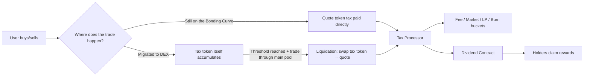
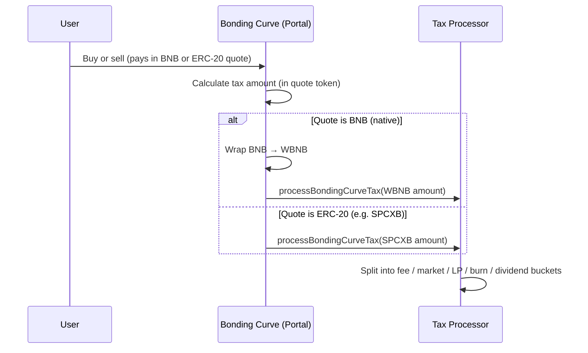
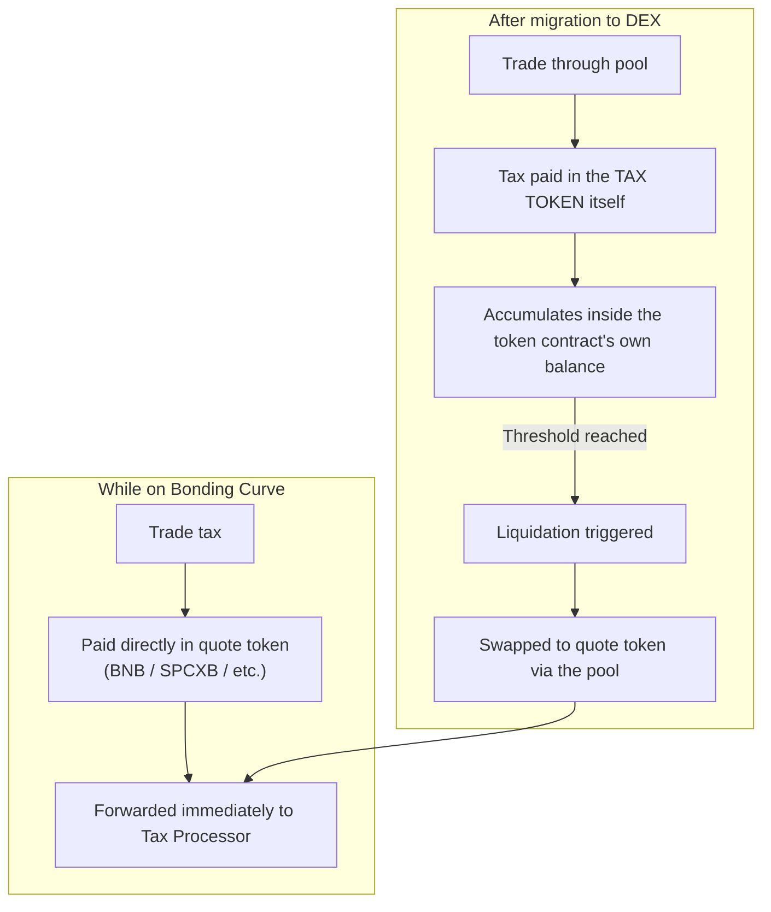
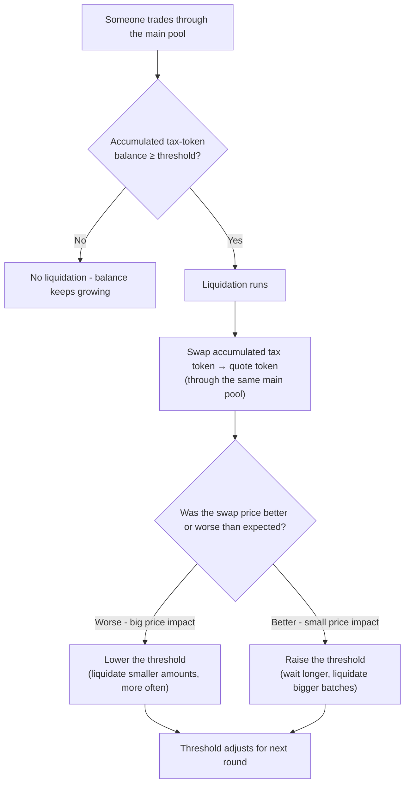
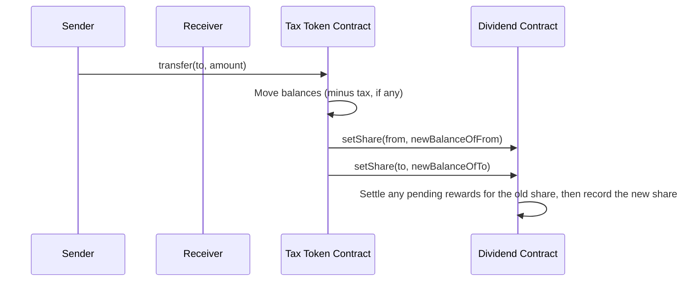
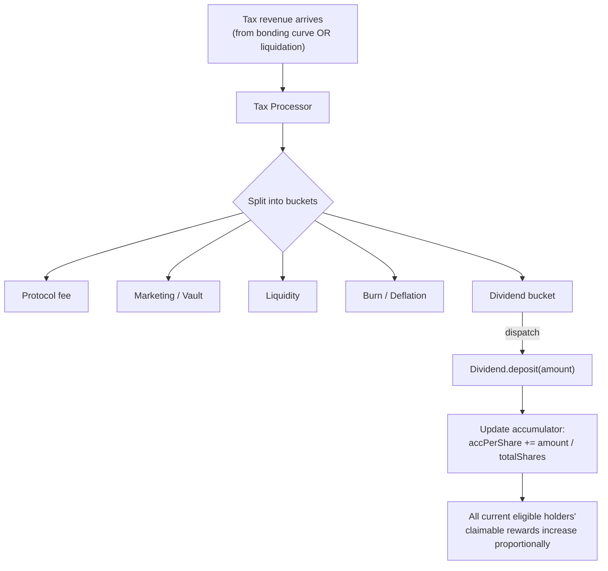
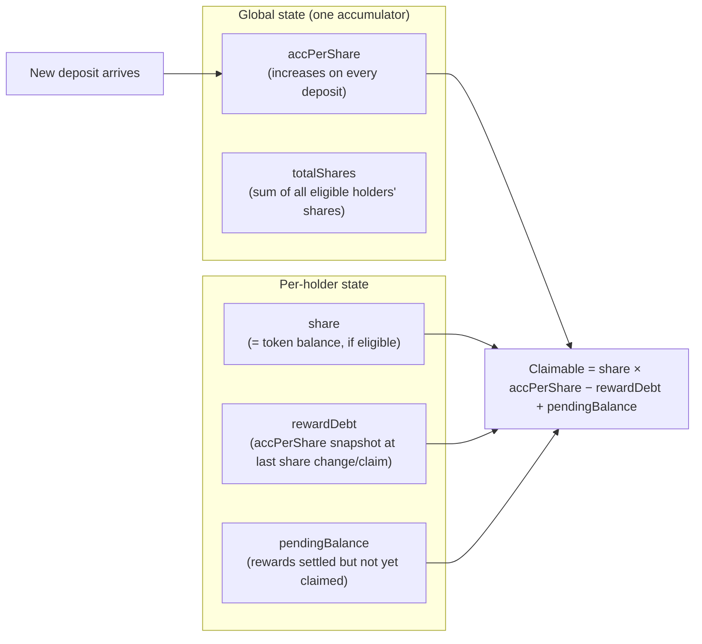
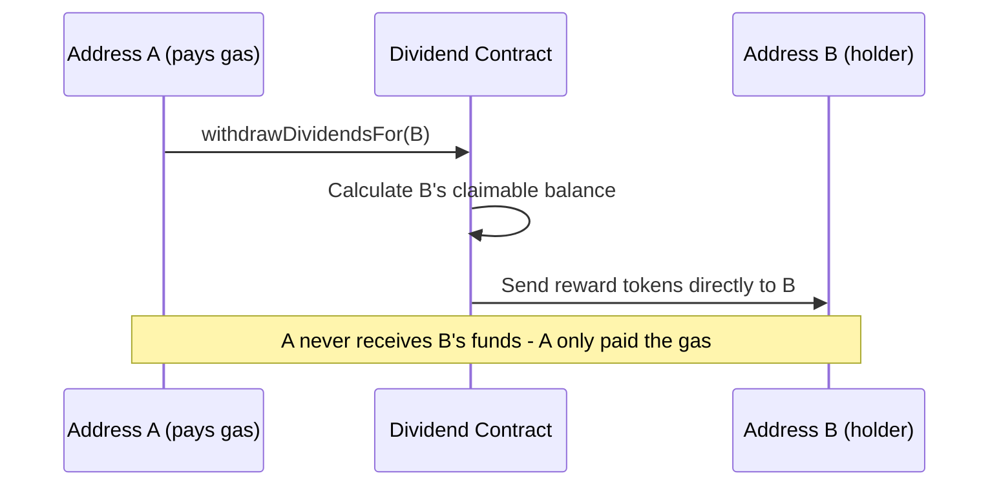
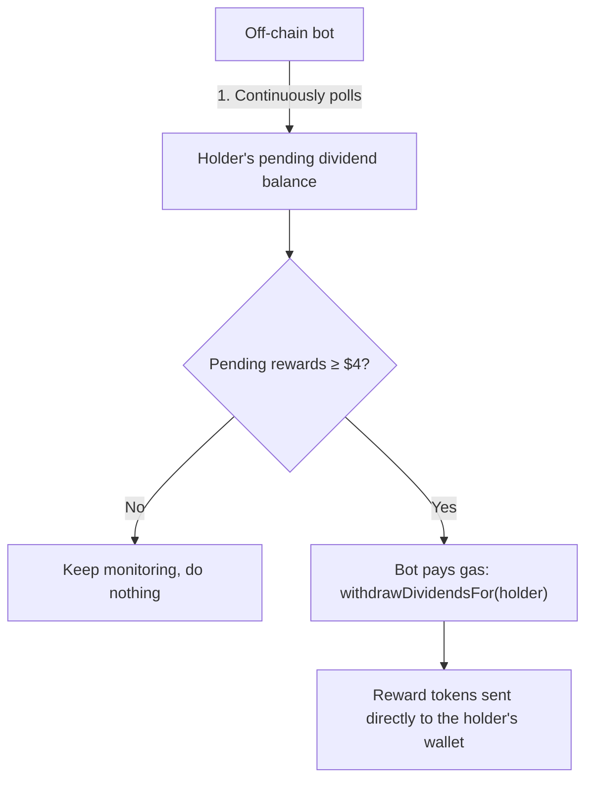

# Flap - Tax Liquidation Mechanism

> Source: https://docs.flap.sh/flap/developers/basic-and-mechanism/flap-tax-token/tax-liquidation-mechanism
> Retrieved: 2026-09-02 (GitBook markdown export, https://docs.flap.sh/flap/developers/basic-and-mechanism/flap-tax-token/tax-liquidation-mechanism.md)

---

> For the complete documentation index, see [llms.txt](https://docs.flap.sh/flap/llms.txt). Markdown versions of documentation pages are available by appending `.md` to page URLs; this page is available as [Markdown](https://docs.flap.sh/flap/developers/basic-and-mechanism/flap-tax-token/tax-liquidation-mechanism.md).

# Tax Liquidation Mechanism


This page explains **how tax gets collected and converted into rewards** for holders, in plain terms. Some technical detail is included for developers, but you don't need to read Solidity to follow along.


## Overview

Every time someone buys or sells a Flap tax token, a small percentage is taken as **tax**. What happens to that tax next depends on one thing: **has the token's bonding curve finished (migrated to a DEX) or not?**

The rest of this page walks through each stage of that diagram.

***

## 1. How tax is charged

### While still on the Bonding Curve

Before a token graduates to a DEX, all trading happens directly against Flap's bonding curve - there is no pool yet, so there is nothing to "liquidate." The tax is taken **in the quote token itself**, at the moment of the trade, and forwarded straight to the Tax Processor.

* If the quote is **BNB** (or another chain's native gas token), the trade contract wraps it into WBNB (or the equivalent wrapped native token) and forwards it.
* If the quote is an **ERC-20** (e.g. a token like `SPCXB`), it's forwarded as-is - no wrapping needed.

There's no waiting, no threshold, no separate "liquidation" step here - the quote token tax is already in the currency everyone wants (BNB, SPCXB, USDT, etc.), so it can be split and forwarded immediately.

### After the token migrates (is listed on a DEX)

Once a token graduates and starts trading on a DEX pool (PancakeSwap / Uniswap / a Uniswap-v2-style fork), the mechanism changes. The tax token contract now taxes trades **in the tax token itself** - every taxed buy or sell leaves a small amount of the *tax token* sitting inside the token's own contract balance.

That balance just sits there, growing with every trade, until it's large enough to be worth converting - that conversion step is called **liquidation** (covered in the next section).

***

## 2. When does liquidation trigger?

Liquidation only applies to **migrated** (DEX-listed) tokens - bonding curve tokens never need it, since their tax is already in quote-token form.

Two conditions must **both** be true for a liquidation to fire:

1. **The accumulated tax-token balance has reached the current liquidation threshold.**
2. **Someone is trading through the token's&#x20;*****main pool*** - the primary PancakeSwap/Uniswap-v2(-fork) pool paired with the token's quote token. Liquidation is checked (and can only trigger) on transfers that touch this pool; trades on unrelated/secondary pools don't count.

### The threshold is dynamic, not fixed

The liquidation threshold **self-adjusts after every liquidation** - it isn't a fixed number. It moves within a range that's typically **50,000 to 400,000 tokens**, depending on the specific token's configuration:

* If a liquidation caused **more price impact than expected** (the swap was "expensive" - the price moved a lot), the threshold is **lowered** so future liquidations sell smaller amounts more frequently. Smaller, more frequent sells put less pressure on the price each time.
* If a liquidation caused **less price impact than expected** (there was plenty of liquidity to absorb it), the threshold is **raised** toward its starting ceiling, so the contract waits for more tokens to build up before selling again.

This means the mechanism is self-correcting: in a thin/volatile market it automatically liquidates in smaller, gentler batches; in a healthy/liquid market it can afford to wait and batch more together.


**Why gate liquidation on "the main pool" specifically?** The main pool is where price discovery actually happens for the token. Restricting the liquidation check to main-pool trades (rather than any transfer) keeps the tax mechanism predictable and prevents it from firing based on unrelated token movement (e.g. wallet-to-wallet transfers, or activity on some other unrelated pool).


***

## 3. How the dividend mechanism works

Flap tax tokens can automatically reward holders with a share of the tax revenue. This works through two connected pieces: **share tracking** (who owns how much, updated on every transfer) and **dividend deposits** (rewards flowing in, distributed proportionally).

### Step A - every transfer updates your "share"

Every time tokens move - a buy, a sell, or a plain wallet-to-wallet transfer - the tax token contract calls into a separate **Dividend contract** to record the sender's and receiver's *new* balance as their "share." Your share is simply your current token balance (some addresses, like pools and the contracts themselves, are excluded).

### Eligibility - when do you actually count as a holder?

* You must hold **at least the minimum share balance** the token was configured with (some tokens set this to a small non-zero amount to filter out dust holders; others accept any balance above zero).
* Certain addresses are **always excluded**, no matter their balance: the token contract itself, the burn address, the Dividend contract, the Tax Processor, and any registered trading pool. This prevents tax revenue from effectively being paid to itself or to liquidity pools instead of real holders.
* Being excluded or below the minimum sets your recorded share to **zero** - you stop accruing new rewards from that point on, though anything already earned remains claimable.

### Step B - where liquidated funds go before reaching holders

When a liquidation happens (or when quote-token tax arrives directly from the bonding curve), the proceeds don't go straight to holders. They pass through the **Tax Processor** first, which splits the incoming amount into buckets according to the token's configuration - for example: protocol fee, marketing/vault share, liquidity, burn (deflation), and **dividend**.

Only the portion allocated to the **dividend bucket** continues on to the Dividend contract. The Tax Processor accumulates this dividend portion, and periodically (via `dispatch()`) pushes it - as an actual token deposit - into the Dividend contract.

### Step C - how a deposit turns into "your" claimable rewards

The Dividend contract uses a well-known, gas-efficient pattern often called **"accumulated rewards per share"** (the same idea used by many staking/farming contracts). Here's the intuition, without the math notation:

1. The contract keeps one running number: **rewards accumulated per unit of share, ever** (`accPerShare`). Every time a deposit lands, this number increases by `deposit amount ÷ total shares outstanding at that moment`.
2. Each holder's claimable balance is effectively `(their share × the current accPerShare) − (their share × the accPerShare value from the last time their share changed or they claimed)`.
3. Because the accumulator only moves forward and each holder's personal "starting point" is recorded whenever their share changes (or they claim), this correctly gives everyone their **proportional slice of every deposit that happened while they held their current share** - without the contract needing to loop over every holder on every deposit.

A practical consequence of this design: **you only earn rewards for the time you actually hold an eligible balance.** If you buy in after a big deposit already happened, your `rewardDebt` snapshot is set to the *current* accumulator value, so you don't retroactively get a share of rewards that were deposited before you held any tokens. Conversely, once you're holding, every future deposit is automatically counted for you - no need to "stake" or opt in separately; simply holding the token is enough.

### Claiming

Holders (or anyone calling on their behalf) can withdraw their claimable balance at any time. The reward token you receive depends on the tax token's configuration - it might be the quote token (e.g. BNB/WBNB), the tax token itself, or a different ERC-20 entirely; whichever was chosen as the token's "dividend token" at launch.

### Anyone can pay the gas to send *your* dividend to *you*

This is a subtle but genuinely useful feature of the Dividend contract: claiming is **permissionless on behalf of others**. There is no requirement that a holder pays their own gas to receive their rewards - any address, call it **A**, can trigger a withdrawal **for** another holder, call it **B**, and the reward tokens still land in **B's** wallet. A only pays the gas; A never receives B's funds.

Why would anyone bother paying gas to claim for someone else? Because it opens the door to **automated reward delivery** - you don't need every holder to remember to claim manually.

**Flap runs exactly this kind of automation as an off-chain bot:**

1. The bot continuously watches each holder's pending (claimable) dividend balance - the same `withdrawableDividendOf(user)` value described in [Step C](#step-c-how-a-deposit-turns-into-your-claimable-rewards) above.
2. Once a holder's pending rewards cross a **$4 USD-equivalent threshold**, the bot calls the withdraw-for-user function on their behalf.
3. The bot pays the gas for that transaction; the reward tokens are still sent directly to the holder's own wallet.

The practical effect: small holders who might never bother claiming a few dollars' worth of rewards (because the gas cost isn't worth their own time or money) still get paid out automatically, without ever having to sign a transaction or spend their own gas.

***

## Summary

| Stage                   | Bonding Curve phase                                                       | After migration (DEX)                                                |
| ----------------------- | ------------------------------------------------------------------------- | -------------------------------------------------------------------- |
| Tax is collected in     | Quote token (BNB/WBNB, or the ERC-20 quote, e.g. SPCXB)                   | The tax token itself                                                 |
| Where it accumulates    | Forwarded to Tax Processor immediately                                    | Inside the tax token contract's own balance                          |
| Trigger to move forward | None needed - already in quote form                                       | Liquidation: threshold reached **and** a trade through the main pool |
| Threshold behavior      | N/A                                                                       | Dynamic, self-adjusting (typically \~50k-400k tokens)                |
| Final destination       | Tax Processor → fee/market/LP/burn/dividend buckets                       | Same - once liquidated into quote token                              |
| Holder rewards          | Dividend bucket deposited into Dividend contract → accPerShare accounting | Same                                                                 |

Whether a token is still bonding or already trading on a DEX, tax revenue always ends up flowing through the same **Tax Processor → Dividend contract** pipeline - the only thing that changes is *what form* the tax is in before it gets there, and *what has to happen* to convert it into that form.
